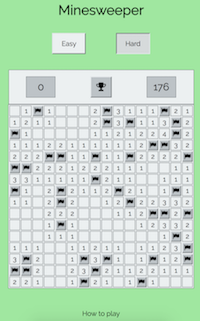

# Minesweeper

The objective of the game is to clear the board without revealing any mines.

### Game modes:
* Easy: The board is 8x8 with 10 mines
* Hard: The board is 16x16 with 40 mines

### Status of the board:
* The upper left number indicates how many mines are left to find.
* The upper middle button is to reset the game.
* The upper right number indicates how much time was passed (in seconds) since the first click.

### How to play:
* Click on each square to clear it. 
    * If the square contains a mine, it's game over. 
    * If it reveals a number, it indicates how many mines are adjecent to the number. 
    * If you click on an empty square, it can help you by opening neighboring squares.
* If you know where a mine is, use **shift+click (or right click)** to put a flag (the mine counter will decrease).
* If you take longer than 999 seconds, you lose.

## Technologies used:
HTML, CSS, JavaScript, jQuery, and git for version control.

## Getting started:
Click [here](https://valeriaoshiro.github.io/Minesweeper/) to play the game

## Next steps:
Will implemement an expert button for 16x30 board with 99 mines. I would also like to play my project on my cellphone.

## Screenshots:
* Easy mode:

 &nbsp;  &nbsp; 
* Hard mode:

 &nbsp;  &nbsp; 